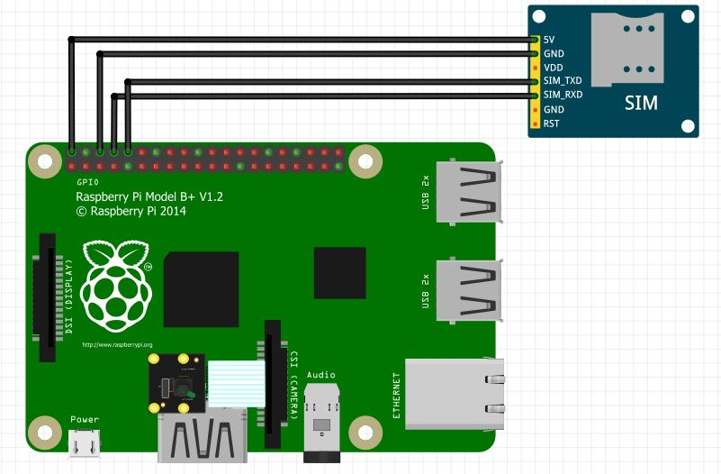

**raspy-smart-cam :** Raspberry Smart Camera with live streaming and motion detection

About
-----

The goal of this project is to implement a lightweight surveillance camera with live streaming and motion detection that triggers a phone call using a GSM module.

Requirements
------------

* Raspberry Pi with Python installed
* Camera module
* SIM800L GSM Module

Wiring
======

Features
--------

* Live streaming of the camera
* Motion detection that triggers a phone call
* Video recording of intruders

How to install
--------------

1. Enable the camera module and the serial port using `raspi-config`
2. Install requirements using `sudo pip install -r requirements.txt`
3. Run `install.sh` and specify where to install the project
4. After installation is done navigate to the directory where the project was installed and change the following settings in `settings.py` : 
	- PIN number of the SIM card
	- Phone number to call when motion is detected
5. Insert the SIM card in the SIM800L module
6. Connect the SIM800L module to the Raspberry Pi
7. Connect the Camera to the Raspberry Pi
8. Reboot the Raspberry Pi

How to use
----------

1. You can view the live stream at `http://your-ip/`
2. You can view and delete videos of intruders at `http://your-ip/videos/`
